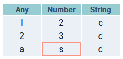

# leptos-datatable

A [leptos](https://github.com/leptos-rs/leptos) component for creating tables with data validation.
The `DataTable` component renders HTML table with given `columns` and `data` props. Each cell in
`data` is validated if the cell datum has same type as its column. Macros for creating columns and
data rows are supported.

## Basic usage

Now, `data` prop for `DataTable` needs to be `leptos::RwSignal<Data>`.

```rust
use leptos::*;
use leptos_datatable::*;

#[component]
fn App() -> impl IntoView {
    let columns = columns![
        "Any", DataType::Any;
        "Number", DataType::Number;
        "String", DataType::String
    ];

    let row1 = row![1, 2, "c"];
    let row2 = row!["2", 3, "d"];
    let row3 = row!["a", "s", "d"]; // "s" is wrong!

    let data = create_rw_signal(Data(vec![row1, row2, row3]));

    view! {
        <DataTable
            columns={columns}
            data={data}
            class="table"
        />
    }
}
```

## DataTypes

- **Number**: Numeric value. Internally saved as `f64`.
- **String**: String value.
- **Any**: Number or String. The default data type for `columns!` macro without data type notation.

## Macros

### Column names

```rust
use leptos_datatable::*;

let columns = columns!["Title", "Year", "Rate"];
```

In this case, data types are specified as `Any`.

### Column names with types

```rust
use leptos_datatable::*;

let columns = columns!["Name", DataType::String; "Age", DataType::Number];
```

### No column names, all same types

```rust
use leptos_datatable::*;

let columns = columns![DataType::Number; 3];
```

**NOTE**: In this case, empty strings are saved as column names. So you should manually specify
the column names. In future releases, prop for hiding table header will be added to `DataTable`.

### Creating a row

```rust
use leptos::RwSignal;
use leptos_datatable::*;

let row = row![1, "A", 2, "B", 3.1, "c", "d"];
```

Similar to the built-in `vec!` macro and it does create a vector of wrapped values(The vector is
again wrapped as struct `Row`). Note that numeric values are internally saved as `f64`.

## Data Validation

Cells with different data types from their columns are marked with red border in the rendered table.



Console warnings for wrong data types will be added in future.

## Basic data operations

`get`, `set`, and `update` are implemented for manipulating value in a specific cell.

```rust
use leptos::*;
use leptos_datatable::*;

let row1 = row![0, 1, 2];
let row2 = row![3, 4, 5];
let data = create_rw_signal(Data(vec![row1, row2]));

assert_eq!(data.get().get(0, 2).get(), 2.into());

data.with(|d| d.set(0, 2, 10));
assert_eq!(data.get().get(0, 2).get(), 10.into());

data.with(|d| d.update(1, 0, |v| {
    if let Datum::Number(Some(n)) = v {
        *v = (*n + 1.0).into();
    }
}));

assert_eq!(data.get().get(1, 0).get(), 4.into());
```

## Styling

The crate only cares about data validation and operations, so styling the table is up to you.
CSS class selector for `DataTable` can be specified through `class` prop. Please refer to styles.css
in the example.
